# ACH/EFT Settlement Flow

This document describes the complete lifecycle of an ACH (Automated Clearing House) or EFT (Electronic Funds Transfer) payment from obligation recognition through settlement and posting.

## Overview

ACH payments follow a four-phase lifecycle:

1. **Obligation** - Invoice/contract creates receivable/payable
2. **Authorization** - Payment approval and NACHA file creation
3. **Clearing/Settlement** - Interbank processing via ACH Operator
4. **Posting** - Account debits/credits and reconciliation

## Flow Diagram

```mermaid
flowchart LR
  %% =========================
  %% ACH / EFT: Obligation -> Authorization -> Clearing/Settlement -> Posting
  %% =========================

  subgraph Payer["PAYER (Debtor) — e.g., Buyer / Customer"]
    direction TB
    P0["Contract / Invoice Received"]
    P1["Obligation Recognized (Accrual)"]
    P2["Accounts Payable (A/P) Ledger"]
    P3["Payment Authorization (Approval + NACHA authorization)"]
    P4["Payment File Created (ACH batch / EFT instruction)"]
    P5["Bank Account / DDA (Payer)"]
  end

  subgraph Payee["PAYEE (Creditor) — e.g., Vendor / Service Provider"]
    direction TB
    R0["Contract / Invoice Issued"]
    R1["Receivable Recognized (Accrual)"]
    R2["Accounts Receivable (A/R) Ledger"]
    R3["Expected Remittance + Posting Rules"]
    R4["Bank Account / DDA (Payee)"]
  end

  subgraph ODFI["ODFI — Payer's Financial Institution (Originating Depository FI)"]
    direction TB
    O1["Validate Batch / Formatting / Limits"]
    O2["Transmit to ACH Operator"]
  end

  subgraph OP["ACH Operator (FedACH / EPN)"]
    direction TB
    A1["Sort + Forward Entries"]
    A2["Net Settlement Calculation"]
  end

  subgraph RDFI["RDFI — Payee's Financial Institution (Receiving Depository FI)"]
    direction TB
    D1["Receive Entries"]
    D2["Post to Payee Account (Credit) or Return (Rxx)"]
  end

  %% =========================
  %% 1) Obligation layer (exists before payment)
  %% =========================
  P0 --> P1 --> P2
  R0 --> R1 --> R2

  %% =========================
  %% 2) Authorization & origination
  %% =========================
  P2 -->|"Payment decision: approve invoice"| P3
  P3 -->|"Create ACH/EFT instruction (CCD/PPD/CTX etc.)"| P4
  P4 -->|"Originate batch"| O1 --> O2 --> A1 --> D1 --> D2 --> R4

  %% =========================
  %% 3) Settlement & posting (conceptual)
  %% =========================
  A2 -. "Interbank settlement (net)" .- ODFI
  A2 -. "Interbank settlement (net)" .- RDFI

  %% =========================
  %% 4) Accounting posting points
  %% =========================
  P5 <-->|"Debit posting (payer account)"| ODFI
  R4 <-->|"Credit posting (payee account)"| RDFI

  %% =========================
  %% 5) Reconciliation feedback loop
  %% =========================
  D2 -->|"Remittance / trace / addenda"| R3 -->|"Post cash receipt"| R2
  O1 -->|"Trace / confirmation"| P2

  %% =========================
  %% Journal Entries (high-level)
  %% =========================
  subgraph JE["Typical Journal Entries (Accrual Basis)"]
    direction TB
    JE1["At Invoice (Payer): Dr Expense/Asset | Cr A/P"]
    JE2["At Invoice (Payee): Dr A/R | Cr Revenue"]
    JE3["At Settlement/Post (Payer): Dr A/P | Cr Cash"]
    JE4["At Settlement/Post (Payee): Dr Cash | Cr A/R"]
  end

  P1 -.-> JE1
  R1 -.-> JE2
  P5 -.-> JE3
  R4 -.-> JE4
```



## Regulatory Constraints & Settlement Rails

To send an ACH credit/debit, you need an ODFI (Originating Depository Financial Institution) that is a regulated financial institution participating in the ACH network (Nacha rules). Your ERP/ledger can create the file/instructions, but a participating ODFI must transmit it.

**Fedwire (wire)**:
Fedwire access is restricted to eligible institutions with an account relationship and FedLine connectivity (typically banks/credit unions/qualified entities). An EIN is not a wire account number. Routing numbers identify banks; they don’t grant origination rights.

**Hard Constraint**:
- **Private Ledger** = Accounting & Authorization (The "Why" and "What")
- **Settlement Rails (ACH/Wire)** = Regulated Origination & Compliance Gatekeeping (The "How")

## Settlement Architecture Options

We support four compliant ways to accomplish settlement (private-first, still pays vendors):

### Option A — "Sponsor Bank / ODFI as a Thin Rail"
- **The Platform Role**: System of record (A/P, approvals, audit pack).
- **Settlement**: Bank/credit union acts as ODFI (ACH) and wire originator.
- **Integration**: Send payment instructions via API/SFTP (NACHA file, ISO 20022 message, or bank portal automation).
- **Flow**: Bank returns statuses; The Platform reconciles.
- **Use Case**: Maximum legitimacy + minimal operational risk.

### Option B — BaaS / Payment Processor (PayFac) Rails
- **Settlement**: Use a regulated provider (Stripe, Modern Treasury, etc.) that can originate payouts (ACH, Same-Day, Wires, Checks).
- **Integration**: API (tokens, webhooks).
- **The Platform Role**: Bill creation, approvals, vendor master, ledger postings, reconciliation.
- **Use Case**: API-first, less bank portal friction.

### Option C — Closed-Loop Netting (No External Rails) + Periodic True-Up
- **Settlement**: Internal clearing model if counterparties agree.
- **The Platform Role**: Tracks mutual obligations and net positions.
- **Flow**: Only the net amount settles externally (via bank rail) on a schedule.
- **Note**: Reduces external transactions but does not eliminate need for external settlement provider.

### Option D — Alternative Payout Methods
- **Methods**: Paper checks (mail service), Card payouts (push-to-card), RTP/FedNow.
- **Constraint**: Still requires regulated participants.

## The "Rail Adapter" Pattern

To make the "bank" optional and replaceable, The Platform implements a **Rail Adapter** interface.

**The Platform Ledger stays authoritative:**
1.  **At Authorization**: `Dr Expense / Cr A/P`
2.  **At Submission**: `Dr A/P / Cr Clearing` (Optional Payments in Transit)
3.  **At Settlement**: `Dr Clearing / Cr Cash` (or `Dr A/P / Cr Cash` if skipping clearing)
4.  **At Final Confirmation**: Close reconciliation.

### Adapter Interface (Conceptual)

```typescript
interface RailAdapter {
  create_payment(instruction: PaymentInstruction): Promise<PaymentResult>;
  submit_payment(paymentId: string): Promise<SubmissionResult>;
  get_status(paymentId: string): Promise<PaymentStatus>;
  handle_webhook(event: WebhookEvent): Promise<void>;
  reconcile(bank_event: BankEvent): Promise<ReconciliationResult>;
}
```

### Supported Adapters
1.  **BaselaneAdapter** (or bank portal batch export/import)
2.  **Plaid/MX** (Read-only feed)
3.  **ODFI/SponsorBankAdapter** (File/API)
4.  **ProcessorAdapter** (Stripe/Adyen/Dwolla-like payouts)

## The "EIN as Account Number" Misconception

An EIN can be used in The Platform as:
- An internal entity identifier
- Part of vendor/customer master
- A key in compliance/audit packs

It **cannot** be used as:
- A bank account number
- A routing credential
- A substitute for ODFI/Fedwire origination

## Why You Can't "Plug ERP into ACH"

**NACHA Operating Rules Requirement**: Every ACH entry must be originated by an **ODFI** (a regulated bank or credit union connected to FedACH or EPN).

Corporates, ERPs, and fintechs **cannot** connect directly to ACH operators. Instead, they must:

1. **Be sponsored by an ODFI** (partner with a bank), OR
2. **Use a Third-Party Sender (TPS) / processor** that already has ODFI sponsorship

The ACH operator is **infrastructure for banks**, not end-users.

## Implementation Notes

The Trust Ledger System implements ACH settlement logic in:

- `components/SettlementEngine.tsx` - UI for settlement workflows
- `services/ledgerService.ts` - Double-entry journal posting with ACH clearing account support
- `conductor/tracks/ach_settlement_20260112/` - ACH settlement track implementation

### Recommended Integration Pattern for Trust Ledger

**API-Driven with Modern Treasury / Unit / Column:**
1. Obligation recognized in `ledgerService.ts` (Dr Expense, Cr A/P)
2. Payment authorized → POST to processor API
3. Processor creates NACHA, submits to ODFI
4. Webhook callback on settlement → clear ACH Clearing account
5. Return webhook → reverse clearing entry, restore A/P

**Chart of Accounts additions needed:**
- `2100` - Accounts Payable
- `2105` - ACH Clearing/Pending (liability or contra-asset)
- `1010` - Cash - Operating Account (DDA)

For integration with 1099 filing, see:
- `conductor/tracks/1099_20260111/` - IRS IRIS 1099 filing track
- `components/IRIS1099Wizard.tsx` - 1099 form wizard with payee management