# ACH/EFT Settlement Flow

This document describes the complete lifecycle of an ACH (Automated Clearing House) or EFT (Electronic Funds Transfer) payment from obligation recognition through settlement and posting.

## Overview

ACH payments follow a four-phase lifecycle:

1. **Obligation** - Invoice/contract creates receivable/payable
2. **Authorization** - Payment approval and NACHA file creation
3. **Clearing/Settlement** - Interbank processing via ACH Operator
4. **Posting** - Account debits/credits and reconciliation

## Flow Diagram

```mermaid
flowchart LR
  %% =========================
  %% ACH / EFT: Obligation -> Authorization -> Clearing/Settlement -> Posting
  %% =========================

  subgraph Payer["PAYER (Debtor) — e.g., Buyer / Customer"]
    direction TB
    P0["Contract / Invoice Received"]
    P1["Obligation Recognized (Accrual)"]
    P2["Accounts Payable (A/P) Ledger"]
    P3["Payment Authorization (Approval + NACHA authorization)"]
    P4["Payment File Created (ACH batch / EFT instruction)"]
    P5["Bank Account / DDA (Payer)"]
  end

  subgraph Payee["PAYEE (Creditor) — e.g., Vendor / Service Provider"]
    direction TB
    R0["Contract / Invoice Issued"]
    R1["Receivable Recognized (Accrual)"]
    R2["Accounts Receivable (A/R) Ledger"]
    R3["Expected Remittance + Posting Rules"]
    R4["Bank Account / DDA (Payee)"]
  end

  subgraph ODFI["ODFI — Payer's Financial Institution (Originating Depository FI)"]
    direction TB
    O1["Validate Batch / Formatting / Limits"]
    O2["Transmit to ACH Operator"]
  end

  subgraph OP["ACH Operator (FedACH / EPN)"]
    direction TB
    A1["Sort + Forward Entries"]
    A2["Net Settlement Calculation"]
  end

  subgraph RDFI["RDFI — Payee's Financial Institution (Receiving Depository FI)"]
    direction TB
    D1["Receive Entries"]
    D2["Post to Payee Account (Credit) or Return (Rxx)"]
  end

  %% =========================
  %% 1) Obligation layer (exists before payment)
  %% =========================
  P0 --> P1 --> P2
  R0 --> R1 --> R2

  %% =========================
  %% 2) Authorization & origination
  %% =========================
  P2 -->|"Payment decision: approve invoice"| P3
  P3 -->|"Create ACH/EFT instruction (CCD/PPD/CTX etc.)"| P4
  P4 -->|"Originate batch"| O1 --> O2 --> A1 --> D1 --> D2 --> R4

  %% =========================
  %% 3) Settlement & posting (conceptual)
  %% =========================
  A2 -. "Interbank settlement (net)" .- ODFI
  A2 -. "Interbank settlement (net)" .- RDFI

  %% =========================
  %% 4) Accounting posting points
  %% =========================
  P5 <-->|"Debit posting (payer account)"| ODFI
  R4 <-->|"Credit posting (payee account)"| RDFI

  %% =========================
  %% 5) Reconciliation feedback loop
  %% =========================
  D2 -->|"Remittance / trace / addenda"| R3 -->|"Post cash receipt"| R2
  O1 -->|"Trace / confirmation"| P2

  %% =========================
  %% Journal Entries (high-level)
  %% =========================
  subgraph JE["Typical Journal Entries (Accrual Basis)"]
    direction TB
    JE1["At Invoice (Payer): Dr Expense/Asset | Cr A/P"]
    JE2["At Invoice (Payee): Dr A/R | Cr Revenue"]
    JE3["At Settlement/Post (Payer): Dr A/P | Cr Cash"]
    JE4["At Settlement/Post (Payee): Dr Cash | Cr A/R"]
  end

  P1 -.-> JE1
  R1 -.-> JE2
  P5 -.-> JE3
  R4 -.-> JE4
```



## Key Participants

### Payer (Debtor)
- Originates payment based on invoice/contract obligation
- Maintains Accounts Payable (A/P) ledger
- Creates NACHA-formatted ACH batch file
- Bank account debited upon settlement

### Payee (Creditor)
- Issues invoice/contract creating receivable
- Maintains Accounts Receivable (A/R) ledger
- Defines remittance posting rules
- Bank account credited upon settlement

### ODFI (Originating Depository Financial Institution)
- Payer's bank
- Validates ACH batch formatting and limits
- Transmits to ACH Operator
- Receives net settlement from operator

### ACH Operator (FedACH or EPN)
- Federal Reserve (FedACH) or Electronic Payments Network (EPN)
- Sorts and forwards entries to receiving banks
- Calculates net interbank settlement amounts
- Facilitates final settlement between institutions

### RDFI (Receiving Depository Financial Institution)
- Payee's bank
- Receives ACH entries from operator
- Posts credits to payee accounts
- Returns entries if unable to post (Return codes: R01-R85)

## Standard Entry Class (SEC) Codes

Common ACH transaction types:

- **CCD** (Cash Concentration or Disbursement) - Corporate payments
- **PPD** (Prearranged Payment and Deposit) - Consumer payments
- **CTX** (Corporate Trade Exchange) - Complex corporate payments with addenda
- **WEB** (Internet-Initiated Entry) - Online consumer payments
- **TEL** (Telephone-Initiated Entry) - Phone-authorized consumer payments

## Journal Entry Posting Points

### At Invoice Recognition (Accrual Basis)

**Payer:**
```
Dr  Expense (or Asset)     $X,XXX.XX
    Cr  Accounts Payable              $X,XXX.XX
```

**Payee:**
```
Dr  Accounts Receivable    $X,XXX.XX
    Cr  Revenue                       $X,XXX.XX
```

### At Settlement/Posting

**Payer:**
```
Dr  Accounts Payable       $X,XXX.XX
    Cr  Cash (Bank Account)           $X,XXX.XX
```

**Payee:**
```
Dr  Cash (Bank Account)    $X,XXX.XX
    Cr  Accounts Receivable           $X,XXX.XX
```

## Settlement Timing

- **Same-Day ACH**: Settlement within same business day
- **Next-Day ACH**: Standard settlement (1 business day)
- **Two-Day ACH**: Legacy timing (rare)

Settlement windows (Eastern Time):
- Morning: 8:30 AM
- Afternoon: 1:00 PM
- Evening: 5:00 PM (same-day only)

## Return Codes (Common)

- **R01**: Insufficient Funds
- **R02**: Account Closed
- **R03**: No Account/Unable to Locate Account
- **R04**: Invalid Account Number
- **R05**: Unauthorized Debit to Consumer Account
- **R07**: Authorization Revoked by Customer
- **R10**: Customer Advises Not Authorized
- **R29**: Corporate Customer Advises Not Authorized

Returns must be submitted within specific timeframes (typically 2-60 banking days depending on return reason).

## Reconciliation

Reconciliation occurs at multiple points:

1. **Pre-transmission**: ODFI validates batch totals match authorization
2. **Operator processing**: ACH Operator confirms entry counts and hash totals
3. **Post-settlement**: RDFI matches received entries to expected remittances
4. **Ledger reconciliation**: Both payer and payee reconcile bank statements to A/P and A/R ledgers

## Related IRS Forms

ACH payments may trigger information return requirements:

- **1099-MISC**: Payments to non-employees ≥$600 (Box 1: Rents, Box 6: Medical/Healthcare, Box 14: Gross proceeds paid to attorney)
- **1099-NEC**: Nonemployee compensation ≥$600
- **1099-INT**: Interest payments ≥$10
- **1099-DIV**: Dividend distributions ≥$10

## References

- [NACHA Operating Rules](https://www.nacha.org/rules)
- [Federal Reserve FedACH](https://www.frbservices.org/financial-services/ach/)
- [IRS Publication 1220: Specifications for Electronic Filing of Forms 1097, 1098, 1099, 3921, 3922, 5498, and W-2G](https://www.irs.gov/pub/irs-pdf/p1220.pdf)
- [ACH Return Codes](https://www.nacha.org/content/ach-return-codes)

## Implementation Notes

The Trust Ledger System implements ACH settlement logic in:

- `components/SettlementEngine.tsx` - UI for settlement workflows
- `services/ledgerService.ts` - Double-entry journal posting
- `conductor/tracks/ach_settlement_20260112/` - ACH settlement track implementation

For integration with 1099 filing, see:
- `conductor/tracks/1099_20260111/` - IRS IRIS 1099 filing track
- `components/IRIS1099Wizard.tsx` - 1099 form wizard with payee management
