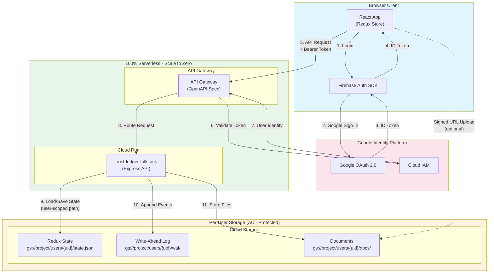
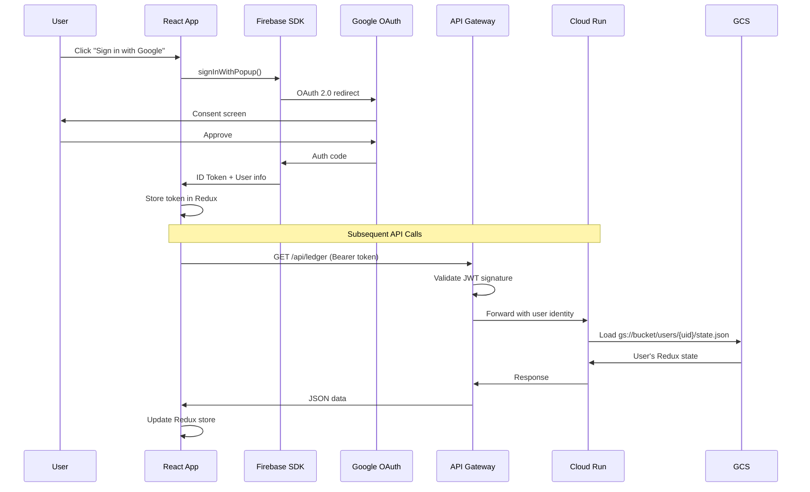

# Serverless Architecture - Trust Ledger System

## Deployment Overview

This system is **100% serverless** with scale-to-zero capability. All user data is isolated via Google Identity with per-user GCS paths.

## Architecture Diagram



## Component Details

| Component | GCP Service | Scale to Zero | Per-User ACL |
|-----------|-------------|---------------|--------------|
| **Frontend** | Cloud Run (static) | ✅ | N/A |
| **API** | Cloud Run | ✅ | Firebase Token |
| **Gateway** | API Gateway | ✅ | Token validation |
| **Auth** | Firebase Auth | ✅ | Google Identity |
| **State** | GCS | ✅ | `users/{uid}/` |
| **WAL** | GCS | ✅ | `users/{uid}/wal/` |

## Authentication Flow



## Storage ACL Pattern

Each user's data is isolated by their Firebase UID:

```
gs://gen-lang-client-0754063985-trust-data/
├── users/
│   ├── {uid-1}/
│   │   ├── state.json          # Redux state
│   │   ├── wal/
│   │   │   ├── 2026-01-21T10:00:00.json
│   │   │   └── 2026-01-21T10:05:00.json
│   │   └── docs/
│   │       ├── affidavit-001.pdf
│   │       └── resolution-002.pdf
│   └── {uid-2}/
│       └── ...
```

## Cost Analysis

| Service | Free Tier | Overage |
|---------|-----------|---------|
| Cloud Run | 2M requests/month | $0.40/million |
| API Gateway | 2M calls/month | $3.00/million |
| GCS Storage | 5GB | $0.02/GB/month |
| Firebase Auth | 50K MAU | $0.01/MAU |

**Estimated cost at low scale: $0/month**

## Deployment Command

```bash
./deploy-production.sh 