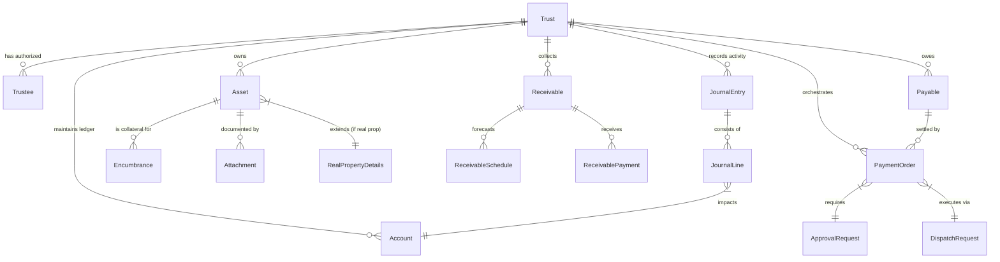
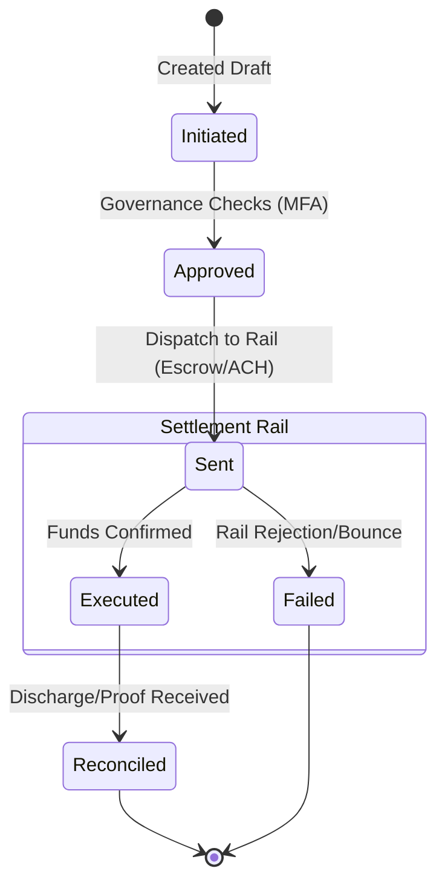
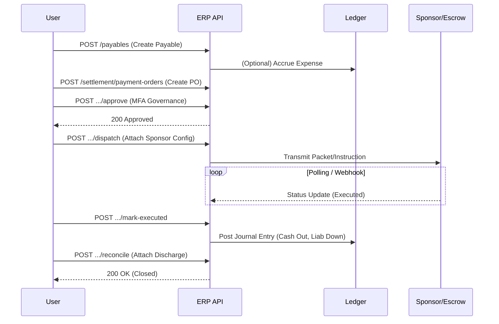

# Las Trust ERP API: Strategic Review & Analysis

## Executive Summary
The **Las Trust ERP API** represents a robust, ledger-first approach to trust administration. By treating the ledger as the source of truth and orchestrating settlement via "sponsored rails" (escrow/ACH), it neatly bridges the gap between legal entity management and financial operations.

## Visual Architecture (Mermaid)

### 1. Entity Relationship Diagram (ERD)
This diagram illustrates the core data model, centering on the `Trust` as the root entity, with key relationships to Ledger, Assets, and Settlement objects.

### 2. Settlement Lifecycle (State Machine)
The `PaymentOrder` is the most complex stateful object, managing the transition from internal intent to external execution.

### 3. Settlement Process Flow (Sequence)
A typical flow for settling a mortgage payoff or vendor payment via an orchestrated packet.

## Strategic Analysis

### Strengths
1.  **Ledger-First Architecture**: Connecting every `Asset`, `Receivable`, and `Payable` directly to the GL (Chart of Accounts) is the correct architectural choice for a high-integrity ERP. It prevents the "sub-ledger drift" common in looser systems.
2.  **Explicit Settlement Lifecycle**: Separating `Payable` (the obligation) from `PaymentOrder` (the execution) allows for partial payments, failed retries, and multi-rail settlements (e.g., split wire vs. check) without corrupting the liability record.
3.  **Governance Hooks**: The `/approve` endpoints on critical financial objects (`JournalEntry`, `Payable`, `PaymentOrder`) suggest a built-in "Four-Eyes" principle or m-of-n signature scheme, essential for trust administration.

### Gaps & Recommendations

1.  **Idempotency & Safe Retries**:
    *   **Analysis**: Settlement endpoints like `/dispatch` and `/post` are high-stakes.
    *   **Recommendation**: Mandate `Idempotency-Key` headers for all `POST` / `PATCH` operations to prevent double-posting during network partition events.

2.  **Document/Packet Immutable Storage**:
    *   **Analysis**: The system generates "Packets" (e.g., Escrow Payoff).
    *   **Recommendation**: Ensure these are Content-Addressed (CAS) or clearly versioned. A generated packet for a specific payment order should likely be immutable once dispatched.

3.  **Identity & KYC**:
    *   **Analysis**: `Trustee` and `Counterparty` schemas are light on identity verification details (DOB, SSN/EIN encryption, physical address validation).
    *   **Recommendation**: Expand the `Trustee` entity to support CIP (Customer Identification Program) requirements if this system interfaces directly with banking rails.

4.  **Eventing/Webhooks**:
    *   **Analysis**: The `Audit` tag lists events, but there is no mechanism for *push* notifications.
    *   **Recommendation**: Add a subscription model for webhooks, specifically for asynchronous states like `PaymentOrder` transitioning to `Executed` or `Failed`.

5.  **Hard Assets Specificity**:
    *   **Analysis**: `RealProperty` is well modeled, but `PreciousMetals` or `Portfolio` assets might need distinct schemas (e.g., CUSIP/ISIN tracking for securities).

## Conclusion
The API spec is a strong foundation for a specialized ERP. It currently "stops at the border" of the actual banking rail (relying on an "adapter config" in dispatch), which is a smart decoupling strategy. The immediate next step should be implementing the **Ledger** logic to ensure `JournalEntry` creation is automated from business events (Payable creation, Asset purchase), limiting manual journal entries to adjustments only.
